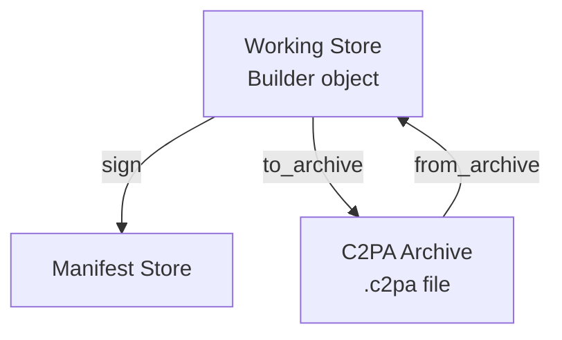
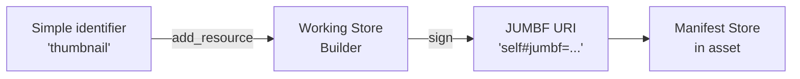

# Working stores and manifest stores

## Terminology

### Manifest store

A **manifest store** is the final C2PA data structure that gets embedded in (or attached to) a signed asset. It contains one or more manifests with each their provenance data and cryptographic signatures.

**Characteristics:**

- Final, immutable signed data embedded in or attached to an asset
- Contains one or more manifests (identified by URIs)
- Has one and exactly one `active_manifest` property pointing to the most recent manifest
- Readable via a `Reader` object

**Example:** When you open a signed JPEG file, the C2PA data embedded in it is the manifest store.

### Working store

A **working store** is a `Builder` object, an editable, in-progress manifest that has not yet been signed and bound to an asset. Think of it as a manifest in progress, or a manifest being built.

**Characteristics:**

- Editable, mutable state in memory (a Builder object)
- Contains claims, ingredients, and assertions that can be modified
- Can be saved to a C2PA archive (`.c2pa` JUMBF binary format) for later use

**Example:** When you create a `Builder` object and add assertions to it, you're dealing with a working store, as it is an "in progress" manifest being built.

### C2PA archive

A **C2PA archive** is the serialized bytes of a working store saved to a file or stream (typically a `.c2pa` file). It uses the standard JUMBF `application/c2pa` format.

**KCharacteristics:**

- Portable serialization of a working store (Builder)
- Should be saved via `Builder::to_archive()` and restored via `Builder::from_archive()` to restore the full working store and continue working on it
- Useful for separating manifest preparation ("work in progress") from final signing

### Overview diagram



| Term | What it is | Where it lives | Primary API |
|------|------------|----------------|-------------|
| **Working store** | Editable in-progress manifest | `Builder` object | `Builder` class |
| **C2PA archive** | Serialized working store | `.c2pa` file/stream | `to_archive()`, `from_archive()` |
| **Manifest store** | Final signed provenance data | Embedded in asset or remotely in cloud | `Reader` class |

## Reading manifest stores from assets

Use the `Reader` class to read manifest stores from signed assets.

### Reading from a file

```cpp
#include <c2pa.hpp>
#include <iostream>
#include <nlohmann/json.hpp>

int main() {
    try {
        // Create a Reader from a signed asset file
        auto reader = c2pa::Reader("signed_image.jpg");

        // Get the manifest store as JSON
        std::string manifest_store_json = reader.json();
    } catch (const c2pa::C2paException& e) {
        std::cerr << "C2PA Error: " << e.what() << std::endl;
    }
}
```

### Reading from a stream

```cpp
#include <fstream>

std::ifstream file_stream("signed_image.jpg", std::ios::binary);
if (file_stream.is_open()) {
    // Create Reader from stream with MIME type
    auto reader = c2pa::Reader("image/jpeg", file_stream);
    std::string manifest_json = reader.json();
    file_stream.close();
}
```

### Using Context for configuration

For more control over validation and trust settings, use a `Context`:

```cpp
// Create context with custom validation settings
c2pa::Context context(R"({
  "verify": {
    "verify_after_sign": true
  }
})");

// Use context when creating Reader
auto reader = c2pa::Reader(context, "signed_image.jpg");
std::string manifest_json = reader.json();
```

### Checking if the manifest store is embedded

```cpp
auto reader = c2pa::Reader("signed_image.jpg");

if (reader.is_embedded()) {
    std::cout << "Manifest store is embedded in the asset" << std::endl;
} else {
    std::cout << "Manifest store is external" << std::endl;

    // Get remote URL if available
    auto remote_url = reader.remote_url();
    if (remote_url.has_value()) {
        std::cout << "Remote URL: " << remote_url.value() << std::endl;
    }
}
```

## Working stores (Builder objects)

A **working store** is represented by a `Builder` object. It contains "live" manifest data as you add information to it.

### Creating a working store

```cpp
// Create an empty working store
c2pa::Context context;
auto builder = c2pa::Builder(context);

// Create a working store with a manifest definition
const std::string manifest_json = R"({
  "claim_generator_info": [{
    "name": "example-app",
    "version": "0.1.0"
  }],
  "title": "Example asset",
  "assertions": [ ... ]
})";

auto builder = c2pa::Builder(context, manifest_json);
```

### Modifying a working store

Before signing, you can modify the working store (Builder):

```cpp
// Update or replace the manifest definition
builder.with_definition(updated_manifest_json);

// Add binary resources (like thumbnails)
builder.add_resource("thumbnail", "thumbnail.jpg");

// Add ingredients (source files)
builder.add_ingredient(ingredient_json, "source.jpg");

// Add actions
const std::string action_json = R"({
  "action": "c2pa.created",
  "digitalSourceType": "http://cv.iptc.org/newscodes/digitalsourcetype/<<pick a type>>"
})";
builder.add_action(action_json);

// Configure embedding behavior
builder.set_no_embed();  // Don't embed manifest in asset
builder.set_remote_url("<<Example remote URL>>");
```

### From working store to manifest store

When you sign an asset, the working store (Builder) becomes a manifest store embedded in the output:

```cpp
// Create a signer
auto signer = c2pa::Signer("Es256", certs, private_key, tsa_url);

// Sign the asset - working store becomes a manifest store
// The manifest store is embedded in the output asset
auto manifest_bytes = builder.sign("source.jpg", "signed.jpg", signer);

// Now "signed.jpg" contains a manifest store
// You can read it back with Reader
auto reader = c2pa::Reader("signed.jpg");
std::string manifest_store_json = reader.json();  // This is the manifest store
```

## Creating and signing manifests

### Creating a Builder (working store)

```cpp
// Create with default context
// manifest_json contains the starting manifest definition
auto builder = c2pa::Builder(manifest_json);

// Or with custom context
c2pa::Context context(R"({
  "builder": {
    "thumbnail": {
      "enabled": true
    }
  }
})");
auto builder = c2pa::Builder(context, manifest_json);
```

### Creating a Signer

For testing, create a signer with certificates and private key:

```cpp
#include <fstream>
#include <sstream>

std::string read_file(const std::filesystem::path& path) {
    std::ifstream file(path);
    std::stringstream buffer;
    buffer << file.rdbuf();
    return buffer.str();
}

// Load credentials
std::string certs = read_file("certs.pem");
std::string private_key = read_file("private_key.pem");

// Create signer
auto signer = c2pa::Signer(
    "Es256",                              // Algorithm: Es256, Es384, Es512, Ps256, Ps384, Ps512, Ed25519
    certs,                                // Certificate chain in PEM format
    private_key,                          // Private key in PEM format
    "http://timestamp.digicert.com"       // Optional timestamp authority URL
);
```

**WARNING**: Never hard-code or directly access private keys in production. Use a Hardware Security Module (HSM) or Key Management Service (KMS).

Supported algorithms: Es256, Es384, Es512, Ps256, Ps384, Ps512, Ed25519. See [X.509 certificate documentation](https://opensource.contentauthenticity.org/docs/c2patool/x_509) for details.

### Signing an asset

```cpp
try {
    // Sign: The manifest store will be embedded in the signed asset
    builder.sign(
        "source_image.jpg",    // Source asset
        "signed_image.jpg",    // Output asset with embedded manifest store
        signer                 // Signer instance
    );

    std::cout << "Signed successfully!" << std::endl;

} catch (const c2pa::C2paException& e) {
    std::cerr << "Signing failed: " << e.what() << std::endl;
}
```

### Signing with streams (recommended)

The stream API is recommended as it provides better control and memory efficiency:

```cpp
#include <fstream>

std::ifstream source("source.jpg", std::ios::binary);
std::fstream output("signed.jpg",
                    std::ios::binary | std::ios::in | std::ios::out | std::ios::trunc);

if (source.is_open() && output.is_open()) {
    // The manifest store will be embedded in the signed asset
    builder.sign(
        "image/jpeg",    // MIME type
        source,          // Input stream
        output,          // I/O stream (must support read, write, and seek)
        signer
    );

    source.close();
    output.close();
}
```

### Complete example: create, sign, and read

```cpp
#include <c2pa.hpp>
#include <nlohmann/json.hpp>
#include <iostream>

using json = nlohmann::json;

int main() {
    try {
        // 1. Define manifest for working store
        const std::string manifest_json = R"({
          "claim_generator_info": [{"name": "demo-app", "version": "0.1.0"}],
          "title": "Signed image",
          "assertions": [
            ...
          ]
        })";

        // 2. Load credentials
        std::string certs = read_file("certs.pem");
        std::string private_key = read_file("private_key.pem");

        // 3. Create signer
        auto signer = c2pa::Signer("Es256", certs, private_key,
                                   "http://timestamp.digicert.com");

        // 4. Create working store (Builder) and sign
        auto builder = c2pa::Builder(manifest_json);
        builder.sign("source.jpg", "signed.jpg", signer);

        std::cout << "Asset signed - working store is now a manifest store" << std::endl;

        // 5. Read back the manifest store
        auto reader = c2pa::Reader("signed.jpg");
    } catch (const c2pa::C2paException& e) {
        std::cerr << "Error: " << e.what() << std::endl;
        return 1;
    }

    return 0;
}
```

## Working with resources

Resources are binary assets referenced by manifest assertions, such as thumbnails or ingredient thumbnails.

### Understanding resource identifiers

When you add a resource to a working store (Builder), you assign it an identifier string. The SDK will automatically convert this to a proper JUMBF URI when the manifest store is created during signing.

**Resource identifier workflow:**



1. **During manifest creation**: You use a string identifier (e.g., `"thumbnail"`, `"thumbnail1"`)
2. **During signing**: The SDK converts these to JUMBF URIs (e.g., `"self#jumbf=c2pa.assertions/c2pa.thumbnail.claim.jpeg"`)
3. **After signing**: The manifest store contains the full JUMBF URI that you use to extract the resource

### Extracting resources from a manifest store

To extract a resource, you need its JUMBF URI from the manifest store:

```cpp
// Pre-requisite: Having a JSON-parsing library to parse the Reader's JSON easily

auto reader = c2pa::Reader("signed_image.jpg");
json manifest_store = json::parse(reader.json());

// Get active manifest
std::string active_uri = manifest_store["active_manifest"];
json& manifest = manifest_store["manifests"][active_uri];

// Extract thumbnail if it exists
if (manifest.contains("thumbnail")) {
    // The identifier is the JUMBF URI
    std::string thumbnail_uri = manifest["thumbnail"]["identifier"];
    // Example: "self#jumbf=c2pa.assertions/c2pa.thumbnail.claim.jpeg"

    // Extract to file using the JUMBF URI
    int64_t bytes = reader.get_resource(thumbnail_uri, "thumbnail.jpg");
    std::cout << "Extracted " << bytes << " bytes to thumbnail.jpg" << std::endl;
}
```

### Extracting to a stream

```cpp
std::ofstream output("thumbnail.jpg", std::ios::binary);
if (output.is_open()) {
    int64_t bytes = reader.get_resource(thumbnail_uri, output);
    output.close();
}
```

### Adding resources to a working store

When building a manifest, you add resources using identifiers. The SDK will reference these in your manifest JSON and convert them to JUMBF URIs during signing.

**Pattern:**

```cpp
auto builder = c2pa::Builder(manifest_json);

// Add resource with a simple identifier
// The identifier must match what you reference in your manifest JSON
builder.add_resource("thumbnail", "path/to/thumbnail.jpg");

// Or add from stream
std::ifstream resource_stream("thumbnail.jpg", std::ios::binary);
builder.add_resource("thumbnail", resource_stream);
resource_stream.close();

// Sign: the "thumbnail" identifier becomes a JUMBF URI in the manifest store
builder.sign("source.jpg", "signed.jpg", signer);
```

## Working with ingredients

Ingredients represent source materials used to create an asset, preserving the provenance chain.

### Adding ingredients to a working store

When creating a manifest, add ingredients to preserve the provenance chain:

```cpp
auto builder = c2pa::Builder(manifest_json);

// Define ingredient metadata
const std::string ingredient_json = R"({
  "title": "Original asset",
  "relationship": "parentOf"
})";

// Add ingredient from file
builder.add_ingredient(ingredient_json, "source.jpg");

// Or add from stream with MIME type
std::ifstream ingredient_stream("source.jpg", std::ios::binary);
builder.add_ingredient(ingredient_json, "image/jpeg", ingredient_stream);
ingredient_stream.close();

// Sign - ingredients become part of the manifest store
builder.sign("new_asset.jpg", "signed_asset.jpg", signer);
```

### Ingredient relationships

Specify the relationship between the ingredient and the current asset:

| Relationship | Meaning |
|--------------|---------|
| `parentOf` | The ingredient is a direct parent of this asset |
| `componentOf` | The ingredient is a component used in this asset |
| `inputTo` | The ingredient was an input to creating this asset |

Example with explicit relationship:

```cpp
const std::string ingredient_json = R"({
  "title": "Base layer",
  "relationship": "componentOf"
})";

builder.add_ingredient(ingredient_json, "base_layer.png");
```

## C2PA archives (saving and restoring working stores)

A **C2PA archive** is a serialized working store (Builder object) saved to a file or stream. The default format is the **C2PA JUMBF binary format** (`application/c2pa`), which is the standard way to save and restore working stores.

### Why use C2PA archives?

- **Save work-in-progress**: Persist a working store between sessions
- **Separate creation from signing**: Prepare manifests on one machine, sign on another
- **Share manifests**: Transfer working stores between systems
- **Offline preparation**: Build manifests offline, sign them later

### Archive format

The default format is **C2PA JUMBF binary format**.

### Saving a working store to archive

```cpp
// Create and configure a working store
const std::string manifest_json = R"({ ... })";
auto builder = c2pa::Builder(manifest_json);
builder.add_resource("thumbnail", "thumbnail.jpg");
builder.add_ingredient(ingredient_json, "source.jpg");

// Save working store to archive file (C2PA JUMBF format)
builder.to_archive("manifest.c2pa");

// Or save to stream
std::ofstream archive_stream("manifest.c2pa", std::ios::binary);
if (archive_stream.is_open()) {
    builder.to_archive(archive_stream);
    archive_stream.close();
}

std::cout << "Working store saved to archive" << std::endl;
```

### Restoring a working store from archive

Create a new Builder (working store) from an archive:

```cpp
// Restore from file - creates a new working store
auto builder = c2pa::Builder::from_archive("manifest.c2pa");

// Or restore from stream
std::ifstream archive_stream("manifest.c2pa", std::ios::binary);
auto builder = c2pa::Builder::from_archive(archive_stream);
archive_stream.close();

// Now you can sign with the restored working store
auto signer = c2pa::Signer(...);
builder.sign("asset.jpg", "signed_asset.jpg", signer);
```

### Restoring with context preservation

Load an archive into an existing Builder while preserving its context:

```cpp
// Create working store with custom context
c2pa::Context context(R"({
  "builder": {
    "thumbnail": {
      "enabled": false
    }
  }
})");
auto builder = c2pa::Builder(context);

// Load archive into this working store
std::ifstream archive_stream("manifest.c2pa", std::ios::binary);
builder.with_archive(archive_stream);
archive_stream.close();

// The builder has the archived manifest but keeps the custom context
```

**Note**: Calling `with_archive()` replaces the builder's current state. You cannot merge multiple archives.

### Two-phase workflow example

#### Phase 1: Prepare manifest

```cpp
void prepare_manifest() {
    const std::string manifest_json = R"({
      "title": "Artwork draft",
      "assertions": [ ... ]
    })";

    auto builder = c2pa::Builder(manifest_json);
    builder.add_resource("thumbnail", "thumb.jpg");
    builder.add_ingredient("{\"title\": \"Sketch\"}", "sketch.png");

    // Save working store as archive (C2PA JUMBF format)
    builder.to_archive("artwork_manifest.c2pa");

    std::cout << "Working store saved to artwork_manifest.c2pa" << std::endl;
}
```

#### Phase 2: Sign the asset

```cpp
void sign_asset() {
    // Restore the working store
    auto builder = c2pa::Builder::from_archive("artwork_manifest.c2pa");

    // Create signer using HSM (not shown)
    auto signer = create_hsm_signer();

    // Sign
    builder.sign("artwork.jpg", "signed_artwork.jpg", signer);

    std::cout << "Asset signed with manifest store" << std::endl;
}
```

## Embedded vs external manifests

By default, manifest stores are **embedded** directly into the asset file. You can also use **external** or **remote** manifest stores.

### Default: embedded manifest stores

```cpp
auto builder = c2pa::Builder(manifest_json);

// Default behavior: manifest store is embedded in the output
builder.sign("source.jpg", "signed.jpg", signer);

// Read it back
auto reader = c2pa::Reader("signed.jpg");
assert(reader.is_embedded() == true);  // Manifest store is embedded
```

### External manifest stores (no embed)

Prevent embedding the manifest store in the asset:

```cpp
auto builder = c2pa::Builder(manifest_json);
builder.set_no_embed();  // Don't embed the manifest store

// Sign: manifest store is NOT embedded, manifest bytes are returned
auto manifest_bytes = builder.sign("source.jpg", "output.jpg", signer);

// manifest_bytes contains the manifest store
// Save it separately (as a sidecar file or upload to server)
std::ofstream manifest_file("output.c2pa", std::ios::binary);
manifest_file.write(
    reinterpret_cast<const char*>(manifest_bytes.data()),
    manifest_bytes.size()
);
manifest_file.close();

std::cout << "Manifest store saved externally to output.c2pa" << std::endl;
```

### Remote manifest stores

Reference a manifest store stored at a remote URL:

```cpp
auto builder = c2pa::Builder(manifest_json);
builder.set_remote_url("<<a storage URL>>");

// The asset will contain a reference to the remote manifest store
builder.sign("source.jpg", "output.jpg", signer);
```

### Checking manifest store location

```cpp
auto reader = c2pa::Reader("asset.jpg");

if (reader.is_embedded()) {
    std::cout << "Manifest store is embedded in the asset" << std::endl;
} else {
    // External or remote
    auto url = reader.remote_url();
    if (url.has_value()) {
        std::cout << "Manifest store is remote: " << url.value() << std::endl;
    } else {
        std::cout << "Manifest store is external (sidecar)" << std::endl;
    }
}
```

## Best practices

### Use Context for configuration

Always use Context objects for SDK configuration:

```cpp
c2pa::Context context(R"({
  "verify": {
    "verify_after_sign": true
  },
  "trust": {
    "anchors": ["path/to/trust_anchors.pem"]
  }
})");

auto builder = c2pa::Builder(context, manifest_json);
auto reader = c2pa::Reader(context, "asset.jpg");
```

### Check supported formats

Verify format support before processing:

```cpp
auto supported = c2pa::Reader::supported_mime_types();
std::string mime = "image/webp";

if (std::find(supported.begin(), supported.end(), mime) != supported.end()) {
    auto reader = c2pa::Reader(mime, stream);
} else {
    std::cerr << "Unsupported format: " << mime << std::endl;
}
```

### Use ingredients to build provenance chains

Add ingredients to your manifests to maintain a clear provenance chain:

```cpp
const std::string ingredient_json = R"({
  "title": "Original source",
  "relationship": "parentOf"
})";

builder.add_ingredient(ingredient_json, "original.jpg");
builder.sign("edited.jpg", "signed.jpg", signer);
```

## Additional resources

- [Manifest reference](https://opensource.contentauthenticity.org/docs/manifest/manifest-ref)
- [X.509 certificates](https://opensource.contentauthenticity.org/docs/c2patool/x_509)
- [Trust lists](https://opensource.contentauthenticity.org/docs/conformance/trust-lists/)
- [CAWG identity](https://cawg.io/identity/)
